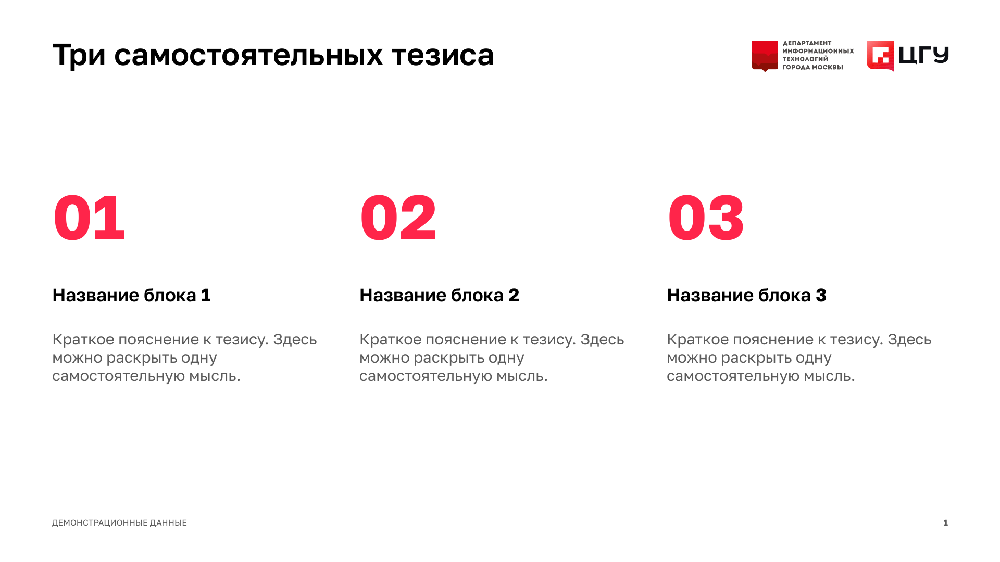
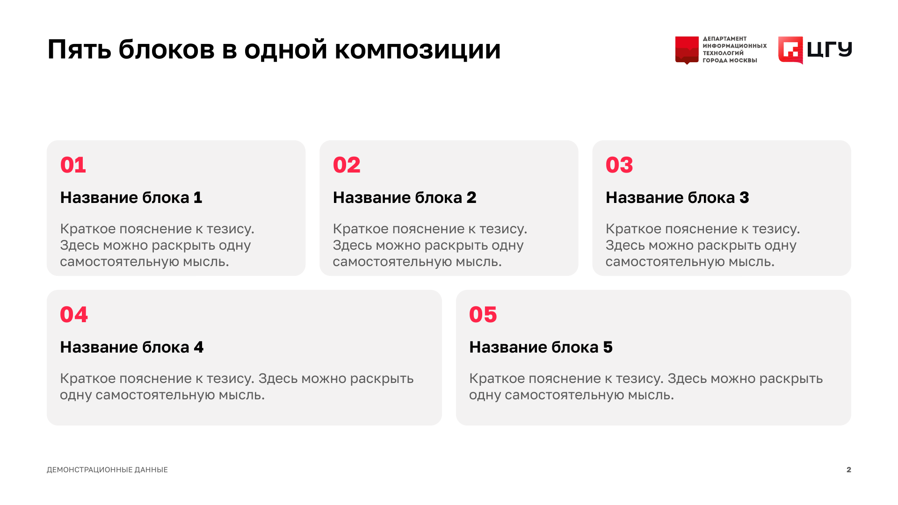
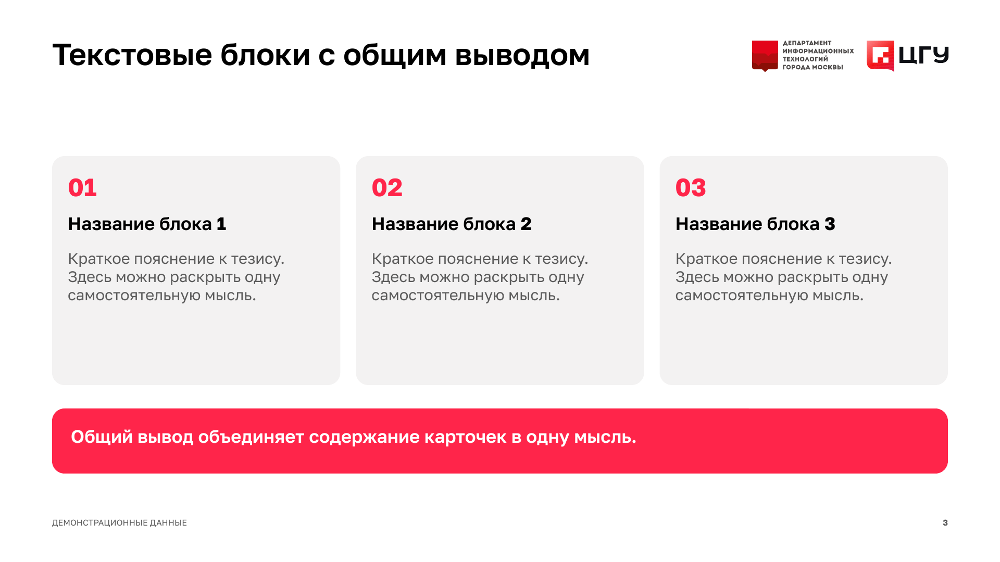
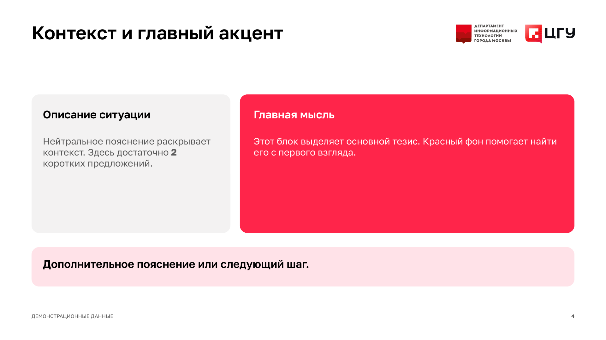
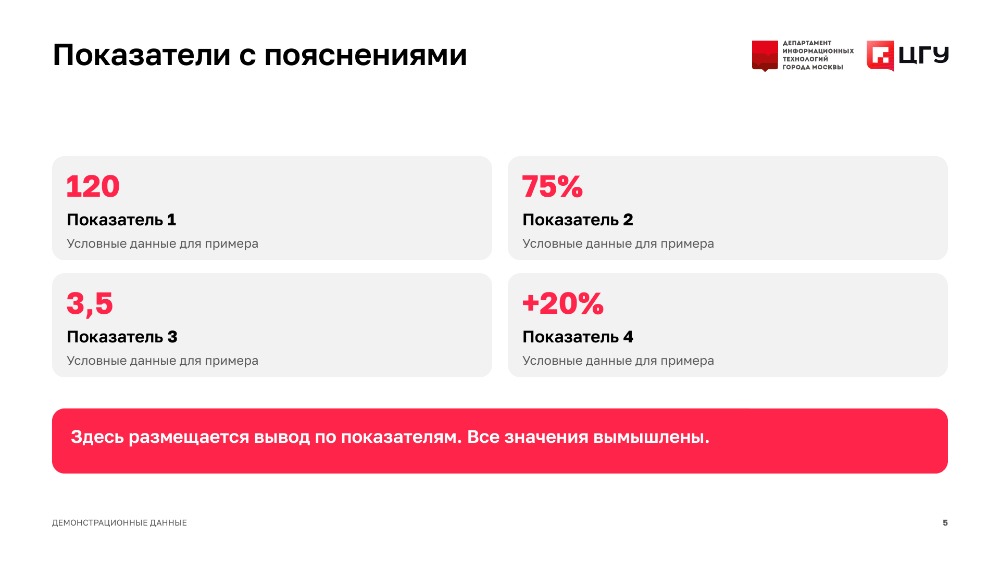
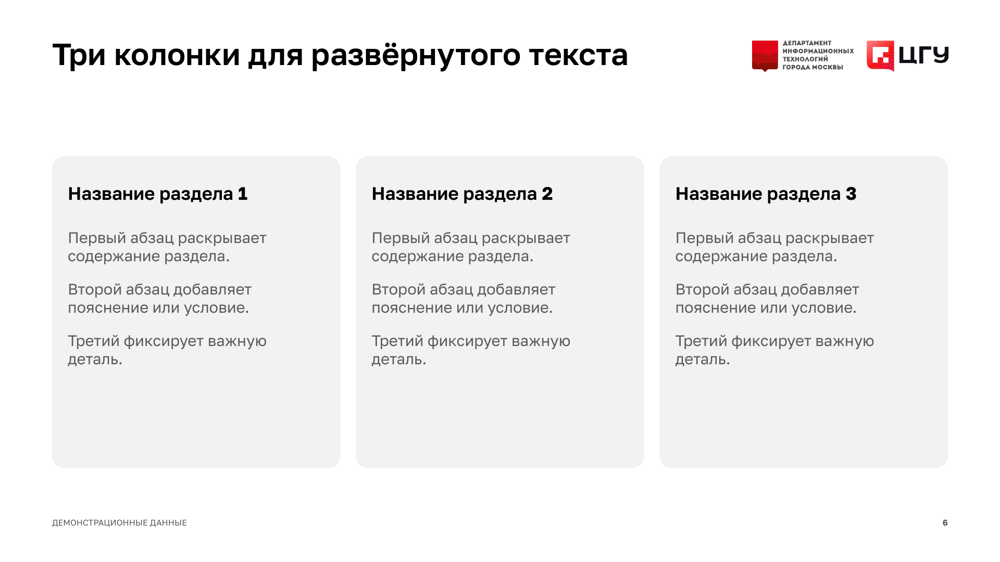

# Текстовые блоки без исходного содержания

Готовый редактируемый [PPTX](../assets/library/text-blocks.pptx), [PDF для просмотра](../assets/library/text-blocks.pdf), [JSON для сборки](../examples/text-blocks-demo.json). Все значения вымышлены. Файл содержит шесть слайдов, по одному на вариант; можно копировать нужный слайд и заменять текст.

Адаптированы композиции из пользовательских презентаций: группировка, пропорции карточек, отступы и цветовая иерархия. Это новые текстовые шаблоны в корпоративной оболочке, а не очищенные копии исходных PPTX. Исходные имена, метрики, скриншоты, иллюстрации и заметки в них не перенесены. Логотипы взяты из ранее поставленного корпоративного шаблона.

Заголовки и названия блоков — Golos Text SemiBold 600. Основной текст — Regular 400. Цифры — Bold 700, в том числе внутри предложения или заголовка. Эти правила применяются и к прежним типам слайдов. Для редактирования установи три начертания из `assets/fonts`; они не встроены в PPTX.

## Выбор композиции

| variant | Блоки | Применение |
|---|---:|---|
| `numbered_columns` | 3 | Три равнозначных тезиса с крупными номерами. Номера показывают порядок чтения, а не причинную связь. |
| `cards_grid` | 5 | Пять самостоятельных пунктов. Две нижние карточки шире; не используй их площадь как код важности. |
| `columns_callout` | 3 | Три наблюдения и одна итоговая мысль. Плашка объединяет содержание карточек. |
| `split_panel` | 2 | Короткий контекст слева, основной тезис справа, дополнительное пояснение внизу. Последовательность из источника упрощена до текстовой плашки. |
| `metrics_band` | 4 | Четыре независимых показателя в сетке 2 × 2 и общий вывод. Разные единицы допустимы только с явными подписями. |
| `text_columns` | 3 | Три развёрнутых блока с абзацами. Перенесён принцип равных колонок; иконки, тематические рубрики и исходное содержание исключены. |

## Контракт

Общие поля: `kind: "text_blocks"`, `variant`, `title`, `items`. Каждый элемент содержит `title` (до 42 символов) и `body`. Для `metrics_band` обязательно `value` (до 12 символов), body до 45. Для `cards_grid` body до 105, для остальных до 240. Это верхние границы, а не гарантия размещения: сборщик измеряет фактический текст, переносы и веса шрифта.

`callout` до 105 символов обязателен для `columns_callout`, `split_panel`, `metrics_band`. В остальных вариантах поле запрещено. Не уменьшай шрифт при переполнении: сократи текст или выбери другую композицию. Полные примеры всех вариантов находятся в JSON выше.

```bash
python3 "$SKILL_DIR/scripts/run.py" build "$SKILL_DIR/examples/text-blocks-demo.json" --out work/text-blocks-01
```

## Визуальные референсы

### Открытые колонки



### Карточки 3 + 2



### Колонки с общим выводом



### Контекст и акцент



### Показатели и вывод



### Текстовые колонки



Проверено: нативный редактируемый текст, логотипы, начертания, экспорт в PDF и просмотр всех шести PNG. PowerPoint вручную не проверялся.
